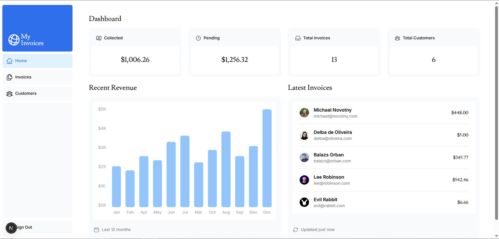

## 🚀 Next.js Financial Dashboard

Bienvenue sur mon projet de tableau de bord financier ! C'est une application de gestion moderne construite avec **Next.js 14+**, exploitant les dernières fonctionnalités du framework pour offrir une expérience utilisateur fluide et performante.

## 🌟 Aperçu du Projet
Ce dashboard permet de gérer des clients et des factures en temps réel. Il met l'accent sur la performance brute, l'accessibilité et la sécurité des données.

🔗 **Démo en direct :** [https://nextjs-dashboard-coral-phi-14.vercel.app/](https://nextjs-dashboard-coral-phi-14.vercel.app/)

## 🛠️ Stack Technique
* **Framework :** [Next.js](https://nextjs.org/) (App Router)
* **Langage :** [TypeScript](https://www.typescriptlang.org/) (Typage robuste)
* **Styling :** [Tailwind CSS](https://tailwindcss.com/) (Design responsive & moderne)
* **Base de données :** [PostgreSQL](https://vercel.com/storage/postgres) (Hébergé sur Vercel)
* **Authentification :** [NextAuth.js](https://next-auth.js.org/) (Sécurisation des routes)
* **Validation :** [Zod](https://zod.dev/) (Validation des formulaires côté serveur)

## ✨ Fonctionnalités Clés
- **Authentification sécurisée :** Protection des routes et gestion des sessions.
- **Gestion CRUD :** Création, lecture, mise à jour et suppression de factures.
- **Optimisation du rendu :** Utilisation de *Static Site Generation* (SSG) et *Dynamic Rendering*.
- **Streaming & Skeletons :** Chargement progressif de l'interface pour une meilleure perception de la vitesse.
- **Recherche & Pagination :** Filtrage côté serveur pour des performances optimales avec de gros volumes de données.

## 🚀 Installation Locale

1. Clonez le dépôt :
   bash
   git clone [https://github.com/Chadrac-WAKOMYA/nextjs-dashboard.git](https://github.com/Chadrac-WAKOMYA/nextjs-dashboard.git)
`

2.  Installez les dépendances :
    bash
    npm install
    
3.  Configurez vos variables d'environnement (`.env`) avec vos accès PostgreSQL et NextAuth.
4.  Lancez le serveur de développement :
    bash
    npm run dev
    

-----

Dévéloppé avec ❤️ par **Chadrac WAKOMYA**
